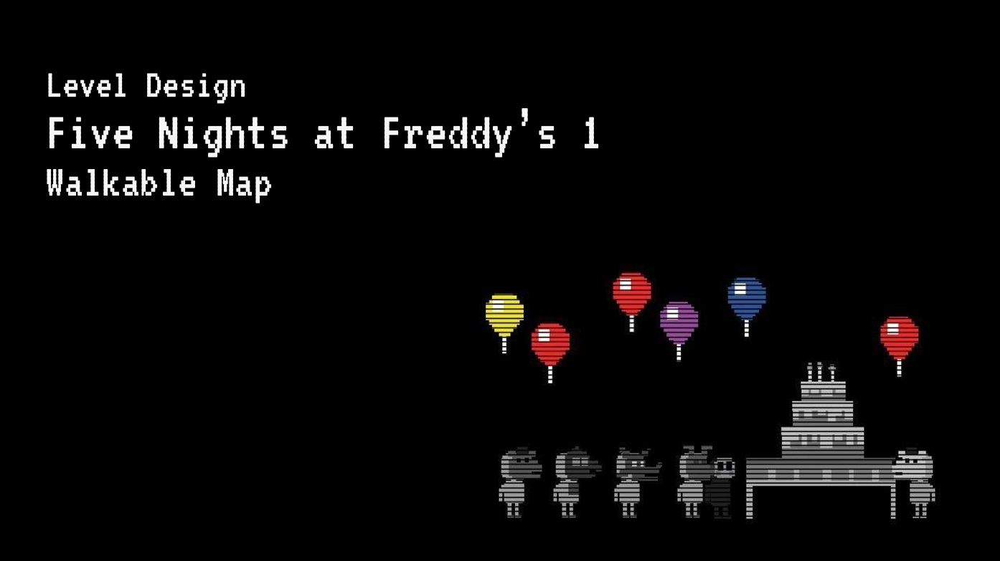
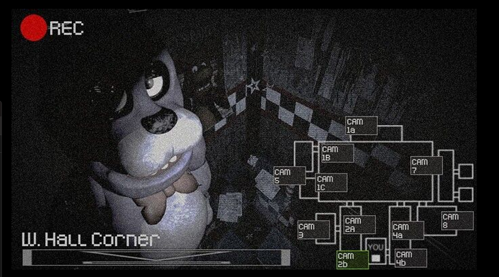
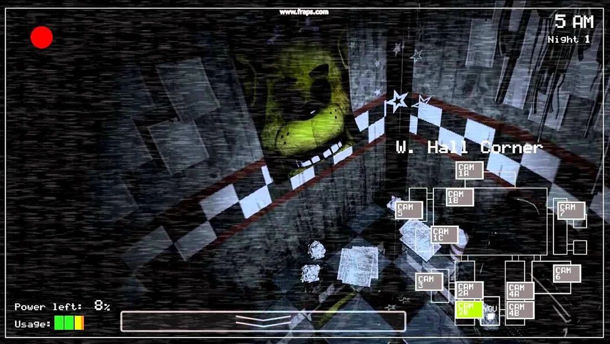
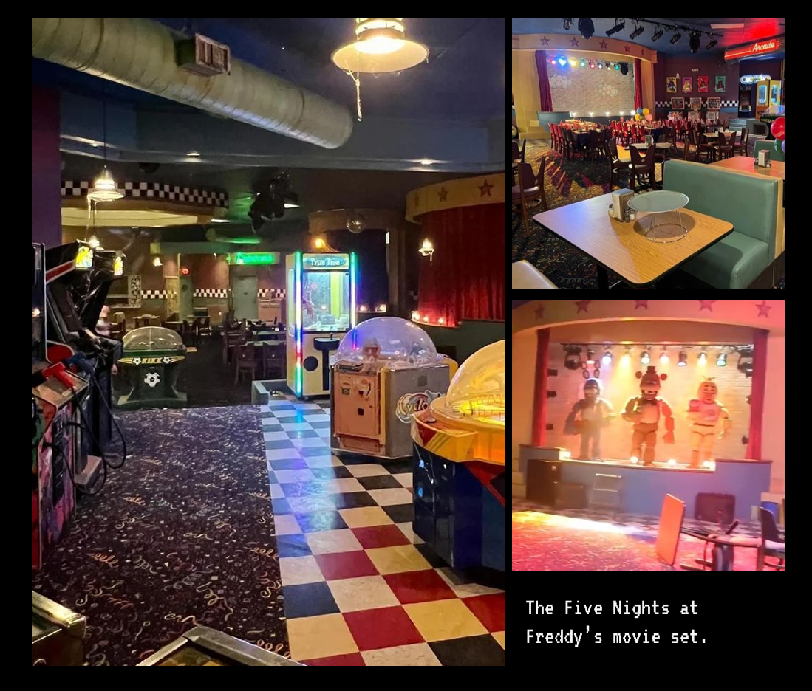
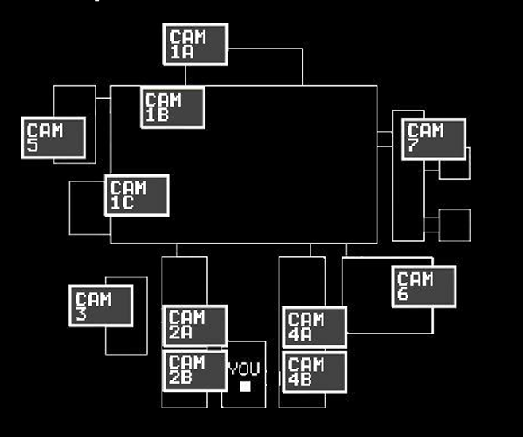
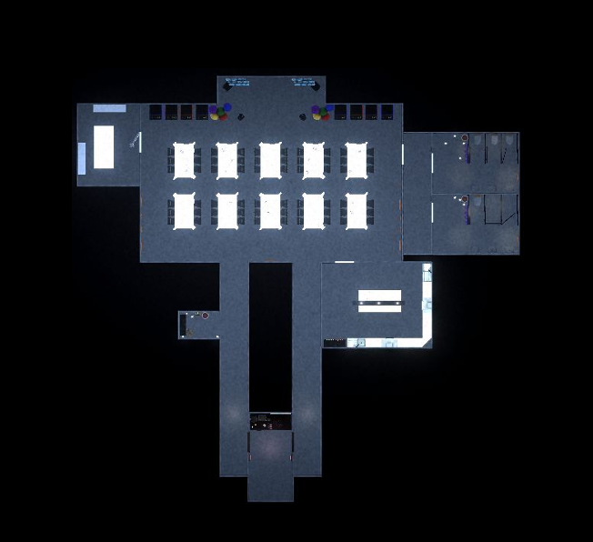
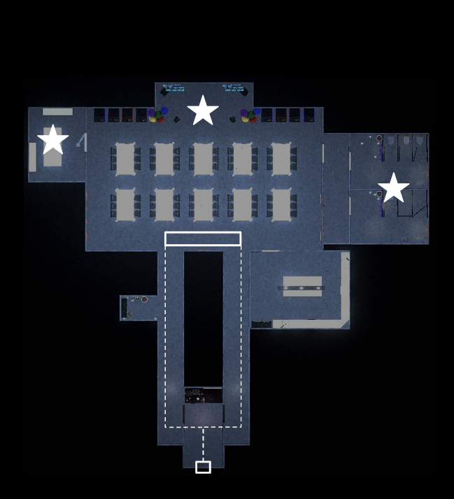

# 3D-Scenery-Fnaf
**Github project page**: [https:///github.com/Jowy02/Motor-Grafico](https:///github.com/000Arthur/3D-Scenery)

## Description
This Project is a Remake/Reimagination of the map of FNAF 1, a point and click indie horror game, as a walkable and interactive space, with modernized visuals and add ons to enhance it’s original vibe, all while staying canon.

## Trailer/Demo

    

<em>Click the image above to watch the full demonstration </em>

## Installation
**_Unzip the [RELEASE FOLDER](https://github.com/000Arthur/3D-Scenery/releases) and execute the .exe file_**

## How to play
### Controls

     * WASD = First-person movement
     * Left Shift = Sprint
     * Mouse movement = Camera control
     * E = Interact with objects
     
## Media References & Inspiration

The original FNAF uses jumpscares to create fear. To survive, you must keep the animatronics out of The Office by managing limited resources:

- Energy: Don’t run out of it.
- Doors: Close them when animatronics are near (drains energy).
- Cameras: Check to track their positions (also drains energy).
  
In the original game, you're confined to The Office.
The rest of the building is only visible through the security cameras, which you use to track and deter the animatronics.
We used these camera views as references to imagine and model how the actual location might look.

    
    

### **Freddy Fazbear's Pizzeria - The place**
- An old, 80’s children-targeted pizzeria.
- Its main focus is to contrast a happy space with terror, putting an exaggerated focus on the kid’s experience.
- Liminality, different zones that clash into each other.
- Lights, sensorial inputs, children’s decorations.
- Based on Chuck-e-cheese’s old birthday parties. 

    

### **Common points with the original media**
We wanted to maintain:
- The Childhood-based horror
- Original map distribution and rooms
- Sharpness
- Original lore and characters

### **Changes and differences with the original media**
Our Additions to the Concept:
- Fully walkable map
- Modernized, HD visuals
- Shift (a bit) from jumpscares to a more sensorial and tense atmosphere (inspired by P.T., Layers of Fear).

To achieve this, we carefully placed blinking lights and scripted events to unsettle the player. Low lighting and narrow corridors were key to building this tense, immersive experience.

## Design
### **Illumination**
As a horror game, atmosphere and sound design were crucial. They had to feel interactive and 
alive. We focused on:
- Dark zones that can be missed unless directly looked at or lit with a flashlight
- Spotlights used to guide attention (ex. Main Stage)

With this approach, the player is guided not just by the map layout, but by illuminated points of interest.
At the same time, light and shadow help build tension and suggest unseen threats.

### **2D Map**
- Camera Map from the game:

    

- Our take :

    

### **Event direction**
Since the player starts in The Office and must move through one of the hallways to reach the Dining Room, we scripted several events to enhance the horror experience:
- Dynamic lighting
- Automated spotlighting on animatronics
Additional ambient events were also included, such as:
- Flickering restroom lights
- An endoskeleton jumpscare
- 

    

## Credits
**All contributors working on this project**:

_Joel Vicente_ « **Github**: [Jowy02](https://github.com/Jowy02)

_Arthur Cordoba_ « **Github**: [000Arthur](https://github.com/000Arthur)

_Jana Puig_ « **Github**: [JanaPuig](https://github.com/JanaPuig)
